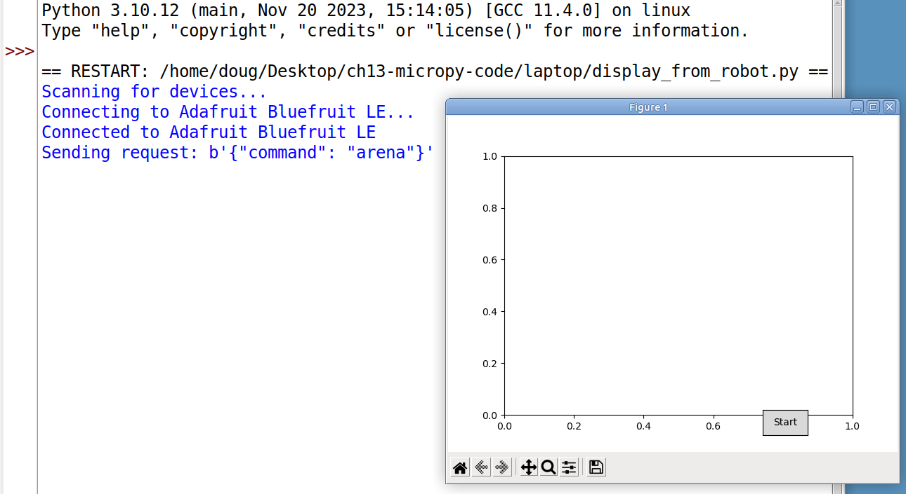

# PicoBot Development
* The book [**Robotics at Home w/ Pico**](/home/doug/Downloads/Robotics_at_home_with_Pico.pdf) demonstrates (in CircuitPython) some useful ideas that can be introduced to my PicoBot
    * Using BLE Friend modules to facilitate teleop controls and laptop data collection & display
    * Using the Bosche BNO055 IMU connected via I2C
        * instead of the BNO08x module in RVC mode (on uart)
            * which needed to be running at 10x loop speed in order to be responsive
    * I ended up learning how to connect >2 VCSEL distance sensors using an I2C multiplexer board.
        * Can have 3 of them giving left/right/fwd dist measurements
* This book also introduced me to the possibility of using Monte Carlo Localization (MCL) and pointed me to some related resources
    * [Video lectures](https://www.youtube.com/playlist?list=PLgnQpQtFTOGQEn33QDVGJpiZLi-SlL7vA) by Cyrill Stachniss (which are based on the book *Probabilistic Robotics*)
    * My latest thinking is to send pose and distance sensor data to the laptop and have a program on the laptop do the processing (Localization, Mapping, etc)
    * At some point, I may explore using the RPLidar A1 to collect and send 360-degree distance data.

## Implementing the code from Chapter 13 in MicroPython

* The author of this book, Danny Staple, shows how to build a robot programmed in CircuitPython. His robot is configured with
    * Differential motor drive using 2 motors with encoders used for X, Y odometry
    * Bosch IMU for detection of theta-Z orientation
    * 2 Vcsel type distance sensors
* I have already built the PicoBot which has the same configuration but is programmed in MicoPython
* I have decided to adapt my PicoBot to accomplish tasks similar to Danny Staple's robot.
    * For that I need to adapt my MicroPython code using the CircuitPython code as an example to guide me.

* The book's robot will be the inspiration and guidance as I add functionality to the PicoBot, but I don't plan to make an **exact duplicate**.
    * Instead of having a robot "stumble" around the arena, avoiding wall collisions
        * I will tele-operate the PicoBot using a joystick type control that senses tipping/tilting of the phone
            * This works by sending the phone's accelerometer data to the robot using BLE
    * But I also want to add an additional Bluefruit LE UART Friend device to allow the robot to send map and pose data to my laptop.
        * For this, I need to free up a 2nd uart channel
            * One uart channel is for sending tele-op driving commands from my phone
            * The second is for sending pose data and the arena map to a program on my laptop which plots the data.
    * Currently, my robot has a bno08x IMU (in RVC mode) on uart1
        * In order to free up this uart, I will instead use a bno055 IMU connected on one of the I2C buses
        * This [video tutorial](https://core-electronics.com.au/videos/raspberry-pi-pico-workshop-chapter-44-i2c) shows how to do this.
        * I end up with one VCSEL distance sensor on i2c0 and the other sharing the i2c1 bus with the IMU.

### Running the code:
* [laptop folder](laptop) contains files that are run on the laptop
* [robot folder](robot) contains files that are run on the Pico

* to Run:
    1. Start the file `main.py` on the robot (either in Thonny or just power up the PicoBot.)
    2. Open the Bluefruit connect app (cell phone)
        * then connect to the first listed of the 2 BLE UART Friend devices
        * then select Controller
        * then select Accelerometer.
    3. On the laptop, run the file `display_from_robot.py`. It's important to have the phone app already connected so the laptop has no other choice but to connect to the device on uart1.

    

### The notes below track my early code in [robot-old](robot-old) that led up to the most recent version.
* This code replicates the functionality of the CircuitPython code up to:
    * page 306 (in book hard copy) / page 329 (in pdf)
    * To Do Next: *Using Sensors to track relative pose*

* Next step: use Numpy which is contained in ulab module
    * To get ulab, need to download `RPI_PICO_W.uf2` file from [GitHub Micropython Builder](https://github.com/v923z/micropython-builder/releases/tag/latest)
        * Replace existing firmware with this new firmware.
        * Running the command `help("modules")` now lists 'ulab' as an available module.

* Successfully ran MicroPython code displaying 20 random dots on arena (Fig 13.7)
    * page 309 (in book hard copy) / page 332 (in pdf)
    * In the current configuration, the Pico (presumed to be mounted on the robot) has a file `main.py` which operates as a BLE peripheral device, sending the arena boundaries and some (fictitious) poses to a BLE central device (laptop).
        * `main.py` imports the file `robot.py`.
        * So far, the only thing being provided by `robot.py` is the `uart` object used to channel BLE communications. That is about to change. 
        
* Next step: Add *Start* button to laptop display
    * page 313 (in book hard copy) / page 336 (in pdf)
    * I didn't bother to implement the collision avoidance code in MicroPython. It seems like a lot of extra work without much benefit. The displayed poses are still just the random fictitious ones.
    * Starting in the next step, I am going to have to use a **real robot** to implement some *real robot behavior* so that it can send some *real pose data* (not fictitious) to the laptop.

* Now, I'm *almost* ready to follow along with the code in the *Pose movement probabilities* section (pp 319-323)
    * Unfortunately, when I try to re-acquaint myself with the way the robot connects to the laptop via BLE, it doesnt work. See [robot2laptop_connex_problem.md](robot2laptop_connex_problem.md).
    * After getting that working again, when I run my new `main.py` file on the PicoBot, it doesn't have a command handler, so although the robot works in teleop mode and sends data out on uart1, the connection with the laptop is broken. Here's what I get:

    
    * So before proceeding , I need to integrate my picobot code within an architecture that contains a command handler that talks to the laptop code.
    * That most recent code is in the [`robot`](robot) folder, with no unneeded extraneous files. (The libraries are placed in a `/lib` folder on the Pico.)

