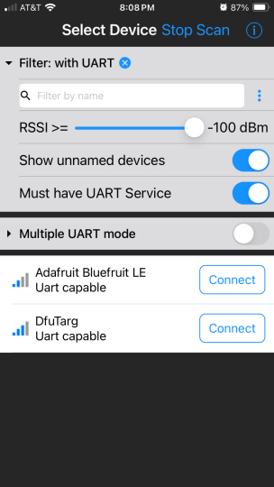
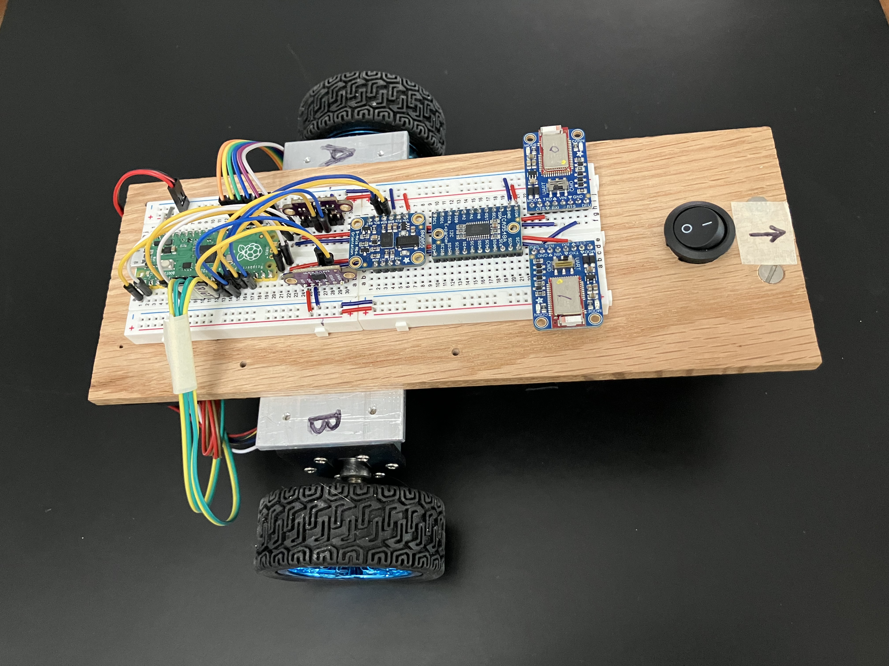
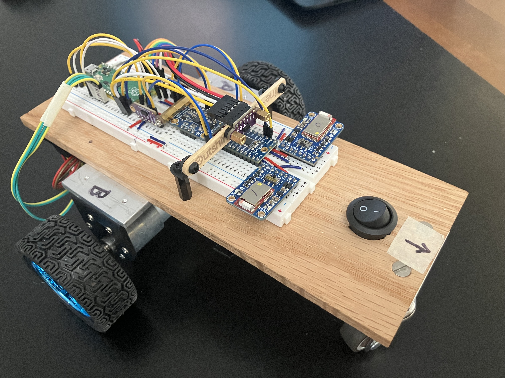
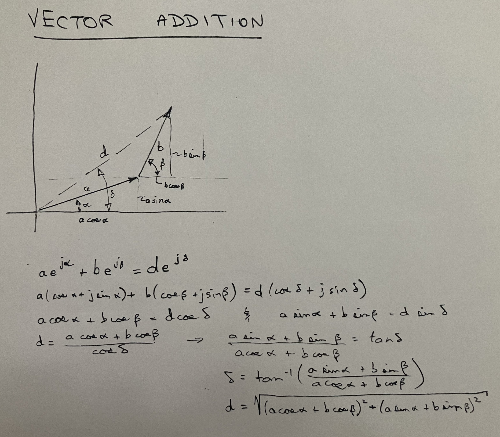
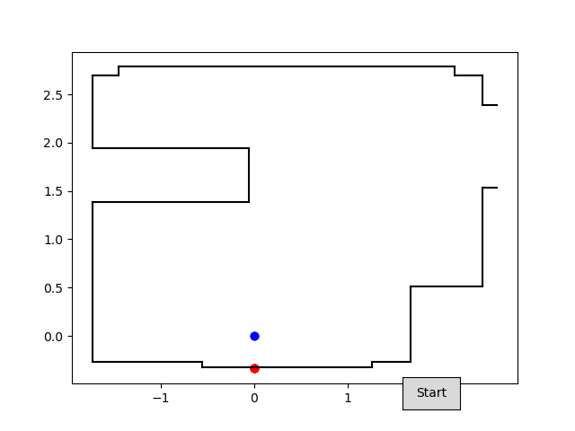
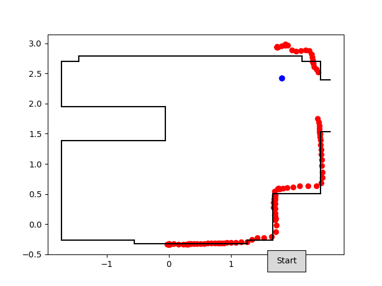
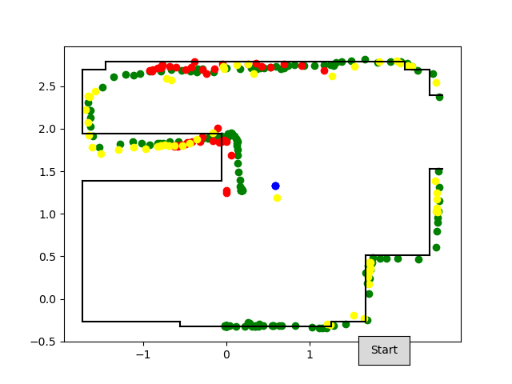
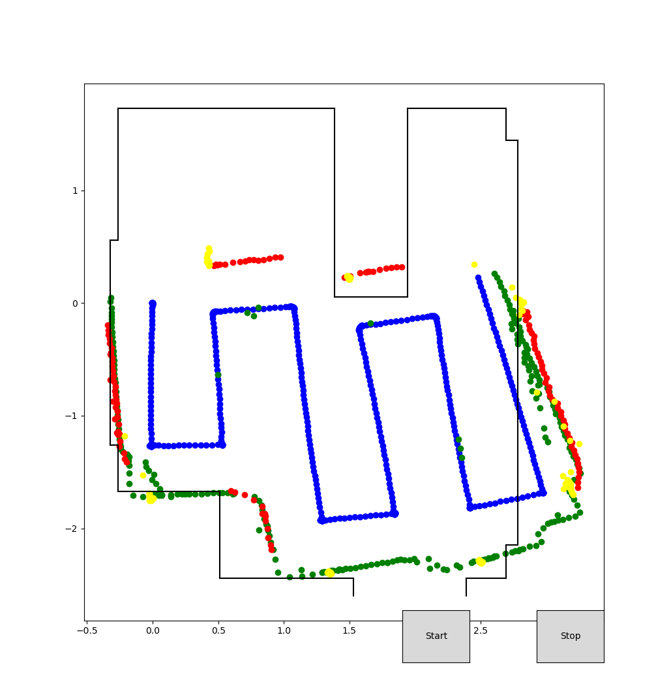
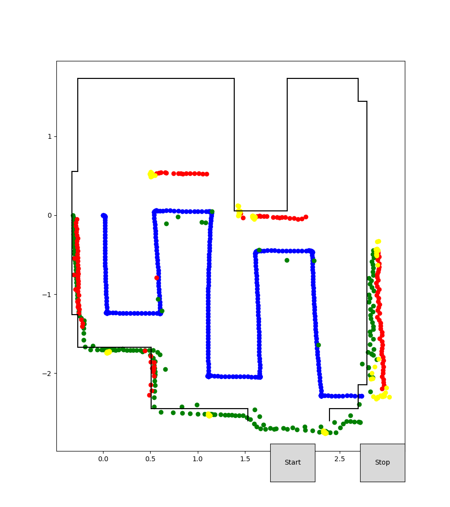

# Inspiration for improving the PicoBot
* The book [**Robotics at Home w/ Pico**](/home/doug/Downloads/Robotics_at_home_with_Pico.pdf) by Danny Staples demonstrates (in CircuitPython) some useful ideas that can be introduced to my PicoBot
    * Using BLE UART Friend modules to facilitate teleop controls and laptop data collection & display
    * Using the Bosche BNO055 IMU connected via I2C
        * instead of the BNO08x module in RVC mode (on uart)
            * which needed to be running at 10x loop speed in order to be responsive
    * I ended up learning how to connect multiple VCSEL distance sensors using an I2C multiplexer board.
        * Can have 3 of them giving left/right/fwd dist measurements
* This book also introduced me to the possibility of using Monte Carlo Localization (MCL) and pointed me to some related resources
    * [Video lectures](https://www.youtube.com/playlist?list=PLgnQpQtFTOGQEn33QDVGJpiZLi-SlL7vA) by Cyrill Stachniss (which are based on the book *Probabilistic Robotics*)
    * My latest thinking is to send pose and distance sensor data to the laptop and have a program on the laptop do the processing (Localization, Mapping, etc)
    * At some point, I may explore using the RPLidar A1 to collect and send 360-degree distance data.

## The new, improved PicoBot

* Tele-operate the PicoBot using a joystick type control that senses tipping/tilting of a cell phone
    * This works by sending the phone's accelerometer data to the robot using BLE
* An additional Bluefruit LE UART Friend device allows the robot to send map and pose data to my laptop.
    * For this, I need to free up a 2nd uart channel
        * One uart channel is for sending tele-op driving commands from my phone
        * The second is for sending pose data and the arena map to a program on my laptop which plots the data.
* Up until now, the Picobot has used a bno08x IMU (in RVC mode) on uart1
    * In order to free up this uart, I will instead use a bno055 IMU connected on one of the I2C buses
    * This [video tutorial](https://core-electronics.com.au/videos/raspberry-pi-pico-workshop-chapter-44-i2c) shows how to do this.
    * I end up with one VCSEL distance sensor on i2c0 and the other sharing the i2c1 bus with the IMU.

### Running the code:
* [laptop folder](laptop) contains files that are run on the laptop
* [robot folder](robot) contains files that are run on the Pico

* to Run:
    1. Start the file `main.py` on the robot (either in Thonny or just power up the PicoBot.)
    2. Open the Bluefruit connect app (cell phone)
        * then connect to the first listed of the 2 BLE UART Friend devices
        * then select Controller
        * then select Accelerometer.
    3. On the laptop, run the file `display_from_robot.py`. It's important to have the phone app already connected so the laptop has no other choice but to connect to the device on uart1.

    

### [Here](early_code.md) are some notes on some of my early attempts at getting the BLE communication working.

### Revised circuitboard configuration
* With the addition of 2 BLE UART Friend modules and multiple sensors sending data on I2C, an I2C multiplexer has also been added.
* A full size breadboard is needed to hold everything.
* Took the opportunity to put the right and left VCSEL distance sensors directly above the wheels.

* Added forward looking VCSEL distance sensor

* Use vector addition to calculate detected points

### Customize arena and plot points detected by distance sensors
* Starting at origin of arena with pose = (0, 0, 0)

* Run No. 1 
    * Begin driving (in Tele-Op mode) CCW around arena perimeter
    * plotting only points detected by right distance sensor (in red)

* Run No. 2 plotting distance values (+ offset) from all 3 sensors 
    * Left -> RED
    * Right -> GREEN
    * Front -> YELLOW

### Instead of Tele-Op, program robot to drive a raster pattern
* Rotate arena axis 90 degrees
* Use Start button to launch
* Add Stop button
* Initially, robot is at pose (0, 0, 0) (aimed to the right)
    * Turn right 90 degrees
    * Then drive *DOWN*
    * then jog *OVER* to the right 1/2 m
    * then *Up*

* Add set_angle method to Odometer to allow correction of pose angle
* Sync pose angle to yaw angle at end of each Y-direction leg

