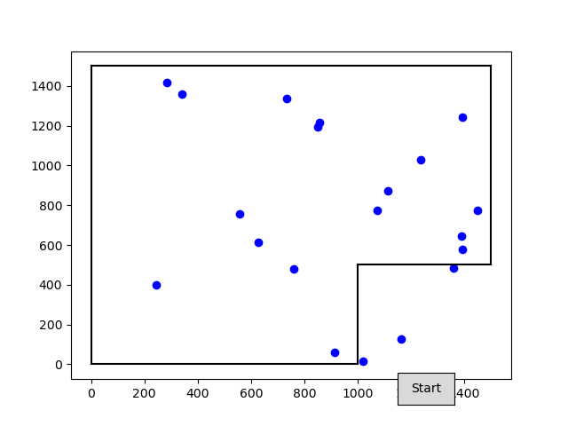

# Difficulties w/ BLE connection between robot & laptop
* Early in this process, I had gotten the MicroPython version of the CircuitPython code that displays the arena on the loptop with 20 random points successfully working.
    * First, I started `main1.py` on the robot
    * Next, I started `display_from_robot.py` on the laptop
* Later on, I had difficulties getting this to work again. Here are some of the things that were preventing me from getting it to work:
    * The Bluetooth *Blueman applet* on my computer was showing a gazillion expired *Adafruit Bluefruit LE* connections. I deleted them all and turned off the laptop's Bluetooth and on again.
    * The laptop found 2 choices of Bluefruit Friend board to connect to, and would connect to uart1 instead of the one on uart0, so I had to remove the one on uart1 to remove the possibility of making the wrong choice.
    * I had moved the uart pins from the default location (pins 0 & 1), Duh!
* Got it working again. (But sometimes I get an `Error parsing JSON` and have to try again.



```
== RESTART: /home/doug/Desktop/ch13-micropy-code/laptop/display_from_robot.py ==
Scanning for devices...
Connecting to Adafruit Bluefruit LE...
Connected to Adafruit Bluefruit LE
Sending request: b'{"command": "arena"}'
Received data: 1500], [1500, 1500]], [[1500, 1500], [1500, 500]], [[1500, 500], [1000, 500]], [[1000, 500], [1000, 0]], [[1000, 0], [0, 0]]]}
Error parsing JSON
Received data: {"poses": [[1388, 643], [855, 1216], [1235, 1028], [626, 614], [1018, 17], [1392, 1241], [735, 1335], [341, 1360], [1358, 486], [557, 758], [1450, 772], [1393, 577], [1072, 774], [850, 1193], [245, 397], [1161, 128], [760, 481], [912, 62], [1114, 871], [285, 1418]]}
```

```
== RESTART: /home/doug/Desktop/ch13-micropy-code/laptop/display_from_robot.py ==
Scanning for devices...
Connecting to Adafruit Bluefruit LE...
Connected to Adafruit Bluefruit LE
Sending request: b'{"command": "arena"}'
Received data: {"arena": [[[0, 0], [0, 1500]], [[0, 1500], [1500, 1500]], [[1500, 1500], [1500, 500]], [[1500, 500], [1000, 500]], [[1000, 500], [1000, 0]], [[1000, 0], [0, 0]]]}
Received data: {"poses": [[1388, 643], [855, 1216], [1235, 1028], [626, 614], [1018, 17], [1392, 1241], [735, 1335], [341, 1360], [1358, 486], [557, 758], [1450, 772], [1393, 577], [1072, 774], [850, 1193], [245, 397], [1161, 128], [760, 481], [912, 62], [1114, 871], [285, 1418]]}
```

